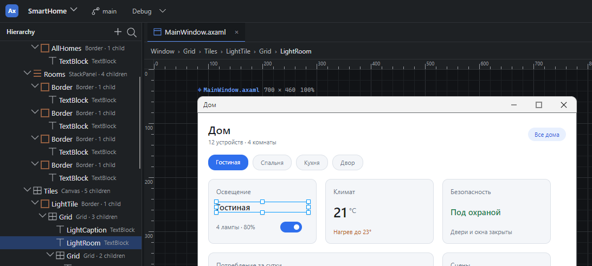
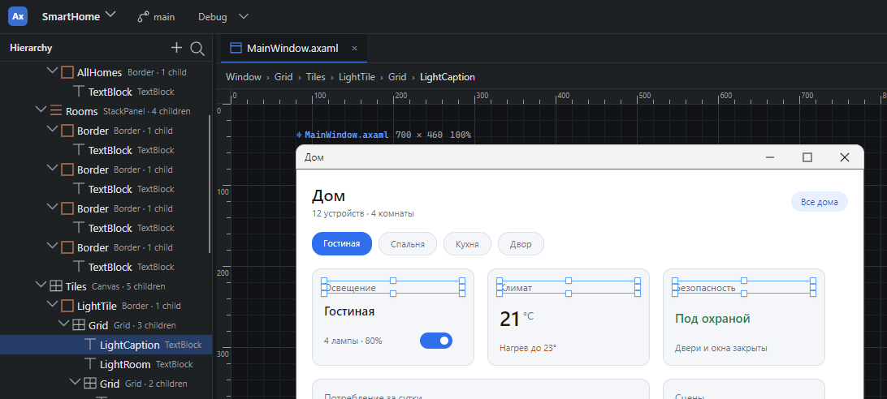
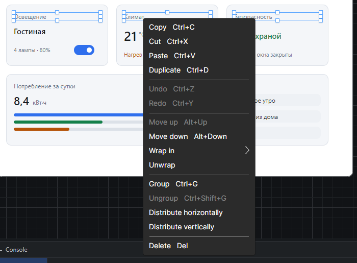
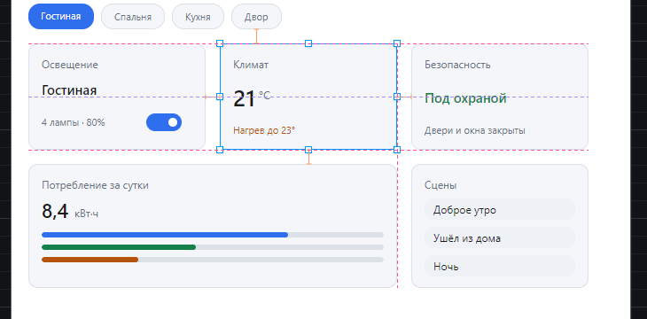
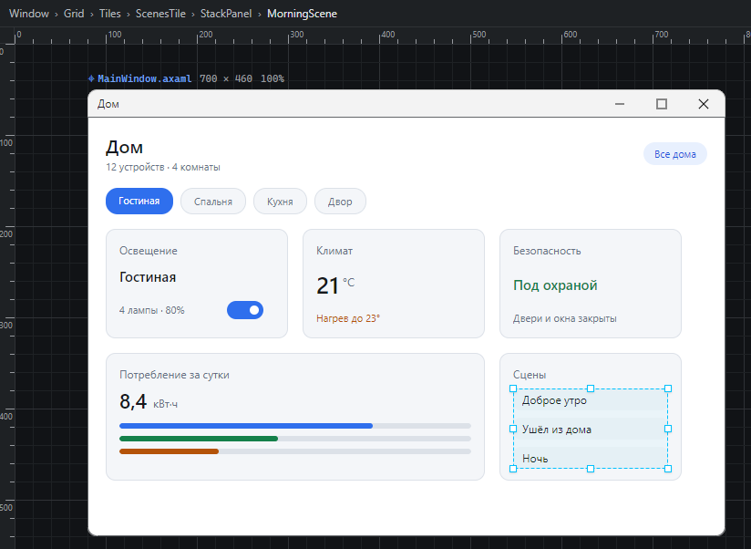
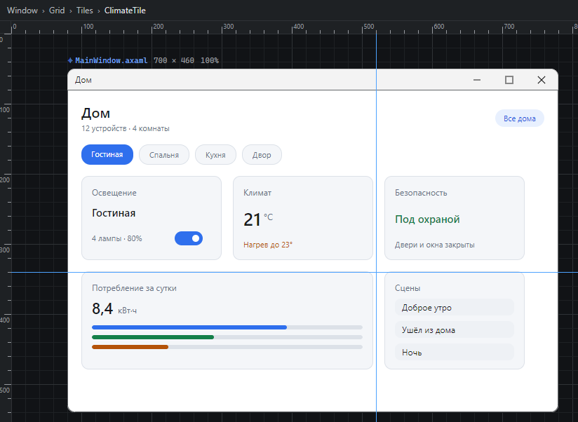

# ArxisStudio.Surface

`ArxisStudio.Surface` — семейство библиотек для Avalonia UI, предназначенное для построения визуальных редакторов, form designer'ов, layout editor'ов и других IDE-подобных инструментов.

Библиотека предоставляет:

- бесконечную поверхность с панорамированием и зумом
- фоновую сетку с попиксельной точностью и уровнями детализации
- прямоугольное и множественное выделение
- контейнеры элементов с drag-and-drop и resize
- editor-level overlay-слои для рамок выделения, marquee и selection handles
- привязку к сетке и выравнивание по краям и центрам соседей с направляющими
- систему attached-свойств для позиционирования
- DPI-aware трансформации для фона, сетки и оверлеев
- демо-приложение с типовым сценарием интеграции

## Как это выглядит

Все снимки сделаны в демо-приложении из этого репозитория — запуск описан [ниже](#запуск-демо).


Пять экранов приложения умного дома лежат на бесконечном холсте: каждый — отдельный `DesignEditorItem` с загруженной разметкой. По краям линейки, сверху шапка: в верхнем ряду шаг сетки, переключатели показа, масштаб, команды вида и отмена, в нижнем — что выбрано и какие у него числа. Слева панель групп, справа панель свойств — обе построены на публичном API: геометрию панель свойств пишет швом редактора, поэтому такие правки отменяются, а раскладку и оформление — прямо в свойства Avalonia, и разделы это помечают. Пользовательские направляющие хост задал, но показ их выключен — за него отвечает переключатель `guides`.

### Выделение



Клик выбирает контрол **внутри** формы, а не форму целиком: в нижнем ряду шапки видно, что выбран `TextBlock`, его раскладка — `Grid`, перемещение она забрала себе (`move None`), и геометрия выделения в design-координатах.



`Shift + Click` собирает группу в пределах одной формы: `Targets: 3`, у каждого свой контур, а `Sel:` показывает общую рамку.

### Контекстные действия



Состав меню задаёт хост через `IDesignEditorContextActionProvider`; редактор лишь сообщает, по чему кликнули и в каком объёме.

## Публичная поверхность

Библиотека экспортирует 59 типов в трёх пространствах имён — `ArxisStudio.Surface` (ядро), `ArxisStudio.Surface.Editing` (инструменты) и `ArxisStudio.Surface.UiDesigner` (дизайнер форм), все под одним адресом разметки `https://github.com/Arxis-Team/ArxisStudio.Surface` (ADR 0003). Всё остальное — реализация и может меняться без предупреждения.

| Область | Типы |
|---|---|
| Редактор | `SurfaceView`, `SurfaceItem` (ядро); `DesignEditor`, `DesignEditorItem` (дизайнер форм) |
| Контролы для шаблонов и тем | `AbsolutePanel`, `DesignGrid`, `SelectionAdorner`, `SelectionAdornerRole`, `ResizeDirection`, `ResizeDeltaEventArgs`, `ResizeStartedEventArgs` |
| Позиционирование и политики | `Layout`, `DesignInteraction`, `MovePolicy`, `ResizePolicy` |
| Группы | `DesignGroup`, `DesignGroupInfo`, `IDesignGroupStore`, `DesignGroupAttachedStore` |
| Настройка ввода | `DesignEditorInputGestures`, `DesignEditorPointerButton`, `ContainerEmptyAreaDragGesture`, `DesignEditorInteractionOptions`, `DesignEditorCursors` |
| Содержимое контейнера | `DesignContentMode` |
| Запросы к приложению | `DesignEditorDeleteRequestedEventArgs`, `DesignEditorReorderRequestedEventArgs`, `DesignEditorHistoryRequestedEventArgs` |
| Выделение | `DesignSelectionTarget`, `DesignSelectionScope`, `DesignSelectionChangedEventArgs` |
| Направляющие и линейки | `DesignGuide`, `DesignGuideOrientation`, `DesignSnapGuide`, `DesignSnapGuideKind`, `DesignSnapGuideOrientation`, `DesignSpacingHint`, `SnapGuideLayer`, `DesignRuler`, `DesignGuideChangeKind`, `DesignGuideChangeRequestedEventArgs` |
| Контракт изменений | `DesignChange`, `DesignGeometryChange`, `DesignOrderChange`, `DesignGroupChange`, `DesignEditKind`, `DesignEditCompletedEventArgs` |
| События контейнера | `DragStartedEventArgs`, `DragDeltaEventArgs`, `DragCompletedEventArgs` |
| Контекстные действия | `IDesignEditorContextActionProvider`, `IDesignEditorContextPresenter`, `ContextMenuContextPresenter`, `DesignEditorContextAction`, `DesignEditorContextRequest`, `DesignEditorContextScope`, `DesignEditorContextSource`, `DesignEditorContextRequestingEventArgs`, `DesignEditorContextRequestedEventArgs` |

Скрыты намеренно:

- **машины состояний** — `EditorState`, `SurfaceItemState` и наследники вместе с `CurrentState`, `PushState`, `PopState`;
- **детали overlay** — `SelectionAdornerLayer`, `SelectionAdornerInfo`, `DesignSurface`, свойства `SecondarySelectionAdorners`;
- **стратегии размещения** — `ArxisStudio.Surface.UiDesigner.Placement.*`: форма ещё должна отлежаться внутри библиотеки, добавить публичный тип позже можно аддитивно.

Поверхность закреплена тестом: новый публичный тип роняет сборку тестов, пока его не внесут в список осознанно либо не сделают `internal`.

## Границы ответственности

`ArxisStudio.Surface` и `ArxisStudio.Markup` — две самостоятельные библиотеки, каждая со своим API.

| | Редактор | Разметка |
|---|---|---|
| поверхность, viewport, сетка | ✔ | |
| выделение, рамки, ручки | ✔ | |
| распознавание жестов | ✔ | |
| геометрия: позиция, размер, `ZIndex` | ✔ | |
| структура дерева: создание, удаление, порядок, перенос | | ✔ |

Редактор **читает** дерево контролов — иначе ему нечего показывать, — но не правит его. Структурные намерения он выражает запросами: `DeleteRequested`, `ReorderRequested`. Пока приложение не пометило запрос `Handled`, ничего не происходит. Почему именно так, а не «взять и сделать» — [ADR 0001](docs/adr/0001-the-editor-reads-the-tree-and-never-writes-it.md).

Отсюда следствие, о котором стоит знать заранее: **без подписки на `ReorderRequested` перетаскивание в потоковой раскладке не делает ничего.** Редактор это учитывает и такой жест не начинает — точка вставки не рисуется, — но и порядок не меняется. Подписка обязательна, если перестановка нужна.

Запрос несёт и индексы, и `Anchor` — ссылку на соседа, перед которым встаёт контрол. Индекс осмыслен только против `Panel.Children`; ссылка переживает любое представление дерева на стороне приложения. Обход подписчиков останавливается на первом, пометившем запрос `Handled`.

Отсюда и деление контракта изменений: `EditCompleted` описывает только правки самого редактора. Запись и отмена структурных правок принадлежат тому, кто ими владеет.

Выделение при этом ходит в обе стороны. С поверхности приложение получает его событием `DesignSelectionChanged`, а обратно — методом `SelectDesignTarget(control, additive)`: у хоста со своим деревом клик по строке должен выбирать контрол на канве, и до появления этого метода сделать это было нечем.

## Структура решения

- `src/Surface/` — `ArxisStudio.Surface`, ядро: холст, viewport, сетка, контейнер, выделение, жесты
- `src/Surface.Editing/` — `ArxisStudio.Surface.Editing`, инструменты: ручки, привязка, направляющие, линейки
- `src/Surface.UiDesigner/` — `ArxisStudio.Surface.UiDesigner`, дизайнер форм: `DesignEditor`
- `samples/DesignEditor.Demo/` — демонстрационное Avalonia-приложение
- `ArxisStudio.Surface.sln` — solution

### Только ядро

Редактору, которому не нужна семантика форм — графу узлов, свободной графике, — хватает одного `ArxisStudio.Surface`: у ядра своя тема, свой контейнер и своя панель. Холст с сеткой, пан и зум (колесом и щипком), выделение кликом и рамкой, перетаскивание с автопрокруткой у края, клавиатура и контракт изменений работают без дизайнера форм.

```xml
<Application.Resources>
    <ResourceInclude Source="avares://ArxisStudio.Surface/Themes/SurfaceTheme.axaml" />
</Application.Resources>

<surface:SurfaceView ItemsSource="{Binding Nodes}">
    <surface:SurfaceView.ItemContainerTheme>
        <ControlTheme TargetType="surface:SurfaceItem" BasedOn="{StaticResource {x:Type surface:SurfaceItem}}">
            <Setter Property="Location" Value="{Binding Location}" />
        </ControlTheme>
    </surface:SurfaceView.ItemContainerTheme>
</surface:SurfaceView>
```

Элемент встаёт в свой `SurfaceItem.Location` — его ставит `SurfacePanel`. Ручек и направляющих у ядра нет: выбранный элемент показывает себя рамкой своей темы (ключи `SurfaceItem.SelectionBrush`, `SurfaceItem.HoverBrush`, `SurfaceItem.SelectionThickness`). Наследнику `SurfaceView` без своей темы нужен `StyleKeyOverride => typeof(SurfaceView)`: Avalonia ищет тему по точному типу.

## Основные компоненты

### `DesignEditor`

Главный контрол редактора. Наследуется от `SelectingItemsControl` и отвечает за:

- позицию viewport через `ViewportLocation`
- масштаб через `ViewportZoom`, `MinZoom`, `MaxZoom`
- выделение через `Selection` и `SelectedItems`
- overlay-систему редактора поверх содержимого
- состояния взаимодействия: idle, selecting, panning
- групповое перемещение выбранных элементов
- навигацию viewport через `CenterOn(...)` и `CenterOnItem(...)`
- вписывание области или элемента через `FitToView(...)`

Текущий template `DesignEditor` уже разделен на слои:

- `ItemsLayer` — реальное содержимое редактора и `DesignEditorItem`
- `SelectionOverlayLayer` — `SelectionAdorner`, secondary outlines, group outline и selection handles
- `InteractionOverlayLayer` — временные interaction overlays, которые живут только во время действия пользователя

`PART_InteractionOverlayLayer` предназначен не для постоянного editor chrome, а для временной визуализации процессов:

- marquee selection rectangle
- snap lines и alignment guides
- drag / resize preview
- insertion markers
- hover preview и временные измерительные подсказки

Сейчас на нём живут прямоугольник marquee-selection и индикатор точки вставки при перестановке среди соседей. Индикатор натянут по соседу, а не по всей панели: в раскладке с переносом строк он обязан оставаться в своём ряду.

Направляющие выравнивания живут не здесь, а в отдельном слое `PART_SnapGuideLayer`: как и сетка, он рисует в экранных координатах без `ViewportTransform`, иначе линия толщиной в пиксель росла бы вместе с зумом.

### `DesignGrid`

Фоновая сетка поверхности. Входит в шаблон `DesignEditor` нижним слоем и включается свойством `ShowGrid`, так что подключать её отдельно не нужно.

Сетка не плиточная `DrawingBrush`, а рендерящийся контрол: он рисует только видимые линии, пересчитывая мировые координаты в экранные. Отсюда три свойства, которых у плиточной заливки быть не может:

- **толщина линий задаётся в пикселях устройства** и не растёт вместе с zoom — на 300% линии остаются в один пиксель;
- **уровни детализации**: когда экранный шаг становится меньше `MinCellSize`, соответствующий уровень скрывается, и на отдалении остаётся разреженная мажорная сетка вместо сплошной заливки;
- **шаг задаётся числом**, а не переписыванием геометрии.

Настройка через ресурсы, без копирования темы:

| Ресурс | Назначение |
|---|---|
| `DesignEditor.Grid.CellSize` | шаг сетки в мировых единицах |
| `DesignEditor.Grid.MajorInterval` | период мажорных линий, в ячейках |
| `DesignEditor.Grid.LineThickness` | толщина в пикселях устройства |
| `DesignEditor.Grid.MinCellSize` | порог скрытия уровня, в пикселях экрана |
| `DesignEditor.Grid.BackgroundBrush` | фон под сеткой |
| `DesignEditor.Grid.LineBrush` | обычные линии |
| `DesignEditor.Grid.MajorLineBrush` | мажорные линии |

Кисти variant-aware: `Light` и `Dark` заданы отдельно. Для собственного фона достаточно `ShowGrid="False"` и `Background` на редакторе.

### Границы контейнеров

Контейнер по умолчанию очерчен только под курсором. Постоянную рамку включает ресурс:

| Ресурс | Назначение |
|---|---|
| `DesignEditorItem.OutlineOpacity` | непрозрачность рамки контейнера в покое; `0` (по умолчанию) — только при наведении |

```xml
<x:Double x:Key="DesignEditorItem.OutlineOpacity">0.75</x:Double>
```

Цвет берётся из `BorderBrush` контейнера. Рамка **оверлейная**: она лежит в той же ячейке шаблона, что и содержимое, и рисуется поверх его края, поэтому не отнимает ни пикселя — форма занимает ровно объявленный размер.

Задавать для этого `BorderThickness` контейнеру нельзя: `Border` разворачивает ребёнка внутри штриха, и форма стала бы на два пикселя уже, чем в разметке. Там, где важна точность геометрии, это ровно та ошибка, которую дизайнер не должен ловить глазами.

`DesignGrid` можно использовать и самостоятельно, связав `ViewportLocation` и `ViewportZoom` с редактором.

### Порядок перекрытия

`BringToFront()`, `SendToBack()`, `BringForward()`, `SendBackward()` меняют порядок выбранных targets и возвращают признак того, что порядок действительно изменился.

Порядок осмыслен только среди соседей по родительской панели, поэтому targets группируются по родителю и переставляются в каждой группе независимо. Относительный порядок внутри выделения сохраняется.

Внутри группы `ZIndex` нормализуется в последовательность `0..n-1`. Без этого перестановка на одну позицию была бы невыполнима: по умолчанию у всех соседей `ZIndex` равен нулю, и менять местами нечего. Поэтому первая операция затрагивает всю группу, а последующие — только сдвинутые элементы: совпавшие отбрасывает фильтр no-op.

Изменение порядка проходит через тот же контракт, что и геометрия — с `Kind = Reorder` и записями `DesignOrderChange`, — поэтому попадает в стек отмены наравне с перемещением.

Порядок перекрытия — это `ZIndex`, свойство контрола, поэтому им редактор распоряжается сам. Порядок среди детей панели — уже структура дерева, и она принадлежит другой библиотеке (см. «Границы ответственности»).

### События выделения

`DesignEditor.DesignSelectionChanged` сообщает об изменении набора design targets — включая вложенные контролы и вложенные контейнеры.

Это **не** унаследованное `SelectingItemsControl.SelectionChanged`: то работает на уровне элементов `ItemsSource`, а это — на уровне targets.

| Свойство | Назначение |
|---|---|
| `OldTargets` / `NewTargets` | наборы до и после |
| `Added` / `Removed` | разница между ними |
| `OldPrimary` / `NewPrimary` | primary target до и после |
| `IsPrimaryChanged` | сменился ли primary |

Событие возникает **только при фактическом изменении**. Перетаскивание, изменение размера и смещение стрелками его не поднимают, хотя внутренний снимок выделения пересобирается на каждом кадре. Повторный клик по уже выбранному target тоже молчит.

Обычный клик по участнику группы не меняет её состав, но переносит target в начало — тогда `Added` и `Removed` пусты, а `IsPrimaryChanged` истинно. Для инспектора свойств это и есть значимое событие.

Наборы сравниваются по `DesignSelectionTarget.Target`, а не по самим обёрткам: они пересоздаются при каждой пересборке overlay, и сравнение по ссылке давало бы ложные срабатывания.

```csharp
editor.DesignSelectionChanged += (_, e) =>
{
    if (e.IsPrimaryChanged)
        inspector.Bind(e.NewPrimary?.Target);
};
```

По той же причине `SelectedDesignTargets` теперь сохраняет прежний экземпляр, пока набор не изменился: привязки к нему и к `SelectedDesignTargetsCount` не пересчитываются во время жеста.

### Клавиатура

| Клавиши | Действие |
|---|---|
| `←` `↑` `→` `↓` | сместить выделение на `InteractionOptions.NudgeStep` |
| `Shift` + стрелки | сместить на `InteractionOptions.LargeNudgeStep` |
| `Alt` + `→` / `←` | отодвинуть / придвинуть правый край — изменить ширину |
| `Alt` + `↓` / `↑` | отодвинуть / придвинуть нижний край — изменить высоту |
| `Alt + Shift` + стрелки | то же крупным шагом |
| `Esc` | снять выделение |
| `Ctrl + A` | выбрать все контейнеры |
| `Delete` / `Backspace` | запросить удаление выделения |
| `Ctrl + Z` | запросить отмену |
| `Ctrl + Y`, `Ctrl + Shift + Z` | запросить повтор |

Модификатор крупного шага задаётся через `InputGestures.LargeNudgeModifiers`, модификатор изменения размера — через `InputGestures.KeyboardResizeModifiers` (`None` его выключает).

Изменение размера с клавиатуры — замена ручкам для тех, кто не может тянуть указателем (WCAG 2.2, «Dragging Movements»). Правила у него те же, что у ручки: сторона должна быть разрешена `DesignInteraction.ResizePolicy`, содержимое не вырастает за свою форму, контрол не сжимается мельче `InteractionOptions.ResizeMinSize` (но и не раздувается, если уже мельче), `MinWidth`/`MaxWidth` сильнее всего. Каждое нажатие — одна запись в стеке отмены.

Смещение стрелками — полноценное изменение: оно уважает `DesignInteraction.MovePolicy` и попадает в стек отмены **одной записью на нажатие**, наравне с перетаскиванием.

Удаление — это **запрос**, а не действие: коллекция приходит через `ItemsSource`, редактор ею не владеет и удалять не может.

```csharp
editor.DeleteRequested += (_, e) =>
{
    foreach (var index in e.Targets
                 .Select(t => editor.IndexFromContainer(t.Container))
                 .Where(i => i >= 0).Distinct().OrderByDescending(i => i))
        Elements.RemoveAt(index);

    e.Handled = true;
};
```

Пока запрос не помечен `Handled`, нажатие считается необработанным и продолжает всплывать — приложение может повесить на `Delete` собственную логику выше по дереву.

Отмена и повтор устроены так же и по той же причине: стека правок у редактора нет. Он сообщает о своих изменениях через `EditCompleted` и умеет применить одно из них (`Revert` / `Reapply`), но что отменять и в каком порядке — знает только тот, кто их копил.

```csharp
editor.UndoRequested += (_, e) =>
{
    if (!history.CanUndo)
        return;

    history.Undo();
    e.Handled = true;   // без этого нажатие всплывёт дальше
};
```

По умолчанию сочетания берутся у платформы (`PlatformHotkeyConfiguration`): на macOS это `Cmd`, и повтор там пишется иначе. Клавиша без модификатора историю не трогает.

Если у приложения своё соглашение, список задаётся снаружи и **заменяет** платформенный:

```csharp
editor.InputGestures.RedoGestures = new[]
{
    new KeyGesture(Key.X, KeyModifiers.Control),
    new KeyGesture(Key.Y, KeyModifiers.Control)
};
```

#### Свои команды

Все клавиши выше — команды набора `KeyCommands`, и приложение правит его так же, как встроенное: добавляет свои команды, заменяет встроенные по идентификатору (константы `SurfaceKeyCommands`) или снимает их.

```csharp
// Своя команда на F2.
editor.KeyCommands.Add(new SurfaceKeyCommand("app.rename", new KeyGesture(Key.F2), view => Rename(view)));

// Escape приложению нужен для другого — встроенное снятие выделения выключается.
editor.KeyCommands.Remove(SurfaceKeyCommands.ClearSelection);
```

Нажатие проходит команды по порядку, и обрабатывает его первая, которая его узнала **и** выполнилась. Команда, которой сейчас делать нечего, возвращает `false` и уступает клавишу следующей — так команда приложения на стрелке не отнимает у встроенного смещения его нажатие. Услышать клавишу раньше встроенной позволяет `Insert(0, …)`; команда с занятым идентификатором в `Add` заменяет прежнюю на её месте.

### Контейнер как хост загруженной формы

`DesignEditorItem` — это контейнер, в который помещается редактируемое содержимое. Откуда оно взялось, задаётся свойством `ContentMode`.

```xml
<design:DesignEditorItem ContentMode="Loaded" Content="{Binding LoadedForm}" />
```

| Режим | Что редактируется | Когда |
|---|---|---|
| `Annotated` (по умолчанию) | только контролы с `Layout.IsTracked` или `Layout.X`/`Y` | шаблон написан вместе с приложением, автор сам решает, что править |
| `Loaded` | вся авторская разметка; содержимое не реагирует на ввод | форма пришла целиком — например, загружена из `.axaml` |

```csharp
var form = (Control)AvaloniaRuntimeXamlLoader.Load(File.ReadAllText(path));
Elements.Add(new FormViewModel { Content = form });   // ContentMode="Loaded" в стиле контейнера
```

Размечать загруженную форму некому, поэтому в режиме `Loaded` target'ом становится любой её элемент. Внутренности контролов при этом не выбираются: обход идёт по авторским связям — дети панели, ребёнок декоратора, контент, если это контрол. У кнопки с текстовым контентом спускаться некуда, и она остаётся листом.

Ввод гасится контейнером: иначе форма живёт своей жизнью — кнопка съедает нажатие, текстовое поле забирает фокус и принимает текст, и выделения не возникает вовсе. Выделение от этого не страдает: попадание считается по прямоугольникам в мировых координатах, а не через hit-testing.

Стратегии размещения работают с загруженной формой без изменений — корень её разметки это обычная панель Avalonia.

### Осведомлённость о раскладке

Редактор знает, какая панель является родителем вложенного контрола, и не предлагает жест, который эта панель не выполнит.

Таблица снята с реальной Avalonia 12 (`LayoutHonourProbeTests`):

| Родитель | Явный `Width`/`Height` | `Layout.X`/`Y` | Перетаскивание |
|---|---|---|---|
| `AbsolutePanel` | honours | honours | задаёт позицию |
| `Canvas` | honours | игнорирует | задаёт `Canvas.Left`/`Top` |
| `StackPanel`, `WrapPanel` | honours | игнорирует | **меняет порядок среди соседей** |
| `Grid`, `DockPanel`, контент-хосты | honours | игнорирует | недоступно |

Явный размер honours любая панель — он применяется до выравнивания, поэтому `HorizontalAlignment="Stretch"` его не съедает. Изменение размера осмысленно везде; ограничивают его `Min`/`Max` контрола и границы формы, а не родительская раскладка.

Действующая политика считается как **политика пользователя ∧ возможности раскладки**. Раскладка задаёт потолок, политика пользователя сужает; ни одна не расширяет другую. Заблокированный жест не выполняется молча — контрол теряет соответствующий affordance.

Причину видно из кода приложения:

```csharp
editor.DesignSelectionChanged += (_, _) =>
{
    status.Text = $"{editor.PrimarySelectionPlacement}: move {editor.PrimarySelectionMovePolicy}";
};
```

- `PrimarySelectionPlacement` — имя раскладки (`Absolute`, `Canvas`, `Stack`, `Grid`, `Dock`, `ContentHost`)
- `PrimarySelectionMovePolicy` / `PrimarySelectionResizePolicy` — **действующие** политики

### Перестановка среди соседей

В раскладке, которая расставляет детей потоком, перетаскивание меняет их порядок — единственное, что вообще меняет там положение. Во время протяжки показывается индикатор точки вставки, а на отпускании редактор поднимает запрос:

```csharp
editor.ReorderRequested += (_, e) =>
{
    // Структурную правку выполняет владелец разметки.
    markup.Move(e.Target, e.OldIndex, e.NewIndex);
    e.Handled = true;
};
```

Пока запрос не помечен `Handled`, порядок остаётся прежним: редактор дерево не трогает.

Это не попадает в `EditCompleted` — там живёт только то, чем редактор распоряжается сам: геометрия и порядок перекрытия. Запись и отмена структурной правки принадлежат тому, кто её выполнил.

### Ограничение размера контейнером

```xml
<design:DesignEditorInteractionOptions IsResizeContainedToParent="True" />
```

Включено по умолчанию: контрол не выходит за границы владеющей формы (`DesignEditorItem`). Без ограничения он продолжает расти, форма его обрезает, а ручки выделения оказываются на пустом холсте.

Границей выбрана именно форма, а не прямой родитель: панель, которая растёт по содержимому, границей быть не может — ограничивать ребёнка высотой, которую он же и задаёт, это рассуждение по кругу. Контейнер верхнего уровня владельца не имеет и не ограничен.

Учитываются также `MinWidth` / `MaxWidth` / `MinHeight` / `MaxHeight` самого контрола. При конфликте побеждает минимум — как и в самой Avalonia.

Выключать имеет смысл там, где overflow задуман: бейдж или тень, намеренно выступающие за край карточки.

### Привязка к сетке

Перетаскивание и изменение размера ставят результат на узел сетки. Привязка включена по умолчанию:

```xml
<design:DesignEditor.InteractionOptions>
    <design:DesignEditorInteractionOptions IsSnapToGridEnabled="True" SnapStep="NaN" />
</design:DesignEditor.InteractionOptions>
```

`SnapStep="NaN"` — шаг берётся у сетки (`DesignGrid.CellSize`). Это значение по умолчанию, и оно не даёт редактору рисовать одну структуру, а привязывать к другой. Явно заданный шаг имеет приоритет.

Удерживание `InputGestures.SnapBypassModifiers` (по умолчанию `Alt`) временно отключает привязку — точное позиционирование остаётся доступным без похода в настройки.

Три правила, которые определяют поведение:

- **Привязывается результат, а не смещение.** Округли редактор дельту — элемент сохранил бы исходный сдвиг относительно сетки и на узел бы так и не встал.
- **При resize привязывается двигающийся край.** Противоположный остаётся на месте, поэтому на узел встаёт именно та сторона, за которую тянут.
- **У группы привязывается рамка целиком.** Привязка каждого target'а по отдельности стянула бы соседей к общим узлам и разрушила взаимное расположение.

Смещение стрелками привязка **не** затрагивает: она исправляет неточный ввод указателем, а клавиатура задаёт смещение точно. Иначе `NudgeStep` меньше шага сетки просто перестал бы работать.

### Направляющие выравнивания


Пунктиром показаны линии выравнивания, найденные во время перетаскивания: розовая — совпадение по краям соседей, фиолетовая — по центрам. Карточку «Климат» ведут внутри формы, и обе линии живут только пока идёт жест.

При перетаскивании элемент выравнивается по краям и центрам соседей, а совпавшие линии рисуются поверх холста. Включено по умолчанию:

```xml
<design:DesignEditor.InteractionOptions>
    <design:DesignEditorInteractionOptions IsSnapToGuidesEnabled="True" SnapGuideTolerance="6" />
</design:DesignEditor.InteractionOptions>
```

По каждой оси сравниваются три точки — ближний край, центр, дальний край, — каждая с каждой. Выравнивание «правый край к левому краю соседа» получается из этого само.

Соседями считается то же, что редактор разрешает выбрать, плюс границы самой формы: по её краям и центру выравнивают чаще всего. При перетаскивании контейнера верхнего уровня соседи — остальные контейнеры.

Правила, определяющие поведение:

- **Оси независимы.** Направляющая занимает свою ось, сетка получает остальные: элемент может встать на край соседа по X и на узел сетки по Y.
- **Направляющая сильнее сетки** на той оси, которую заняла. Сетка задаёт регулярность, направляющая — отношение к конкретному соседу, и оно точнее.
- **Линия натянута между элементом и соседом**, а не проведена через весь холст: по её длине видно, к чему идёт выравнивание.
- **Из соседей исключается всё, что едет вместе с жестом** — сам элемент и остальное выделение при групповом перетаскивании.

`SnapGuideTolerance` задан в пикселях экрана и делится на `ViewportZoom`: иначе на отдалении направляющая хватала бы элемент с расстояния, на котором его не видно. Тот же `SnapBypassModifiers` (по умолчанию `Alt`) отключает и направляющие — обещание «держу нажатым — ставлю куда хочу» одно на всю привязку.

Изменение размера работает по тому же правилу, но выравнивается **потянутый край**, а не позиция: он садится и на край соседа, и на его центральную ось. Неподвижная сторона при этом остаётся на месте. У группы линию ловит рамка выделения целиком.

| Ресурс | Назначение |
|---|---|
| `DesignEditor.SnapGuideBrush` | цвет выравнивания по краю |
| `DesignEditor.SnapGuide.CentreBrush` | цвет выравнивания по центру |
| `DesignEditor.SnapGuide.DashStyle` | штрих линий выравнивания |
| `DesignEditor.UserGuideBrush` | цвет пользовательских направляющих |
| `DesignEditor.UserGuide.DashStyle` | штрих пользовательских направляющих |
| `DesignEditor.SnapGuide.Thickness` | толщина линии в пикселях устройства |

Выравнивание по центру показывается своим цветом, потому что это другое отношение: не «встал вплотную», а «встал симметрично». Центральной линия считается, только когда центры совпали с обеих сторон — совпадение центра с чужим краем остаётся выравниванием по краю.

По умолчанию линии выравнивания пунктирные, а пользовательские сплошные: первые живут только внутри жеста и должны читаться как подсказка, вторые поставлены вами и остаются на макете. Длины штриха задаются в толщинах пера, поэтому не зависят от DPI.

### Равные интервалы



Карточку «Климат» ведут внутри формы, и оба зазора вокруг неё — до карточек слева и справа — показаны оранжевыми отрезками с засечками: это измерение, а не ещё одна ось. Отрезки лежат по середине полосы, общей у элемента и того соседа, до которого он меряет. На том же кадре видно, что оси независимы: горизонтальная занята интервалом, а вертикальная — выравниванием по центрам соседей (фиолетовый пунктир) и по краю (розовый).

Когда элемент подводят к положению, при котором зазоры вокруг него становятся равными, он встаёт на него, а зазоры показываются отрезками с засечками — это измерение, а не ещё одна ось.

Равенство получается двумя способами. **Посередине** — зазоры до соседей слева и справа (или сверху и снизу) равны друг другу. **Повтор шага** — зазор до ближайшего соседа равен тому, который уже стоит дальше по ряду; так элемент продолжает существующий ритм, и это работает даже в конце ряда, где с другой стороны никого нет. Когда подходят оба, побеждает ближайший к тому месту, куда вы ведёте элемент.

Подсказка показывает всю цепочку равных зазоров, а не только соседний: два подряд посередине, три и больше в длинном ряду.

Соседом по интервалу считается только тот, кто лежит с элементом в одном ряду, то есть перекрывается по другой оси; направляющие в расчёт не идут, потому что интервал бывает между элементами, а не до линии.

Порядок разрешения — выравнивание, затем интервал, затем сетка: выравнивание связывает элемент с конкретным краем соседа, а интервал с расстоянием, которого на макете не видно. Оси занимаются независимо.

При изменении размера действует то же правило: неподвижный край задаёт зазор, а потянутый встаёт туда, где второй зазор становится таким же. Схлопнуть элемент ради равенства редактор не станет.

| Настройка | Назначение |
|---|---|
| `InteractionOptions.IsEqualSpacingEnabled` | включено по умолчанию |
| `InteractionOptions.SnapGuideTolerance` | радиус захвата, общий с направляющими |
| `DesignEditor.SpacingBrush` | цвет подсказок |

### Распределить поровну

`DistributeHorizontally()` и `DistributeVertically()` расставляют выбранные элементы так, чтобы зазоры между соседями стали равны. Крайние остаются на месте — они задают отрезок.

Равными делаются именно зазоры, а не расстояния между центрами: при разной ширине элементов это разные результаты, и ровные центры выглядят неровно как раз потому, что зазоры при них разные.

Операция целиком укладывается в одну единицу редактирования, поэтому отмена возвращает весь ряд. Меньше трёх элементов — отказ; заблокированный политикой промежуточный элемент отменяет операцию целиком, а политика крайних роли не играет.

### Группы

Несколько контролов можно объединить в группу: она рисуется одной рамкой и ведёт себя как один элемент — перетаскивается и масштабируется целиком. Группы **вкладываются друг в друга**: выбрав группу и добавив к ней соседа, вы получаете группу из группы и контрола.



Слева панель групп из демо: `group-1` держит группу `scenes` и одиночный `TextBlock`. Панель не знает ни одного внутреннего типа библиотеки — состав она читает `GetGroups`, выбор задаёт `SelectDesignTarget`, имя правит `RenameGroup`. На холсте у всей группы одна рамка.

```csharp
editor.GroupSelection();                                // из текущего выделения
editor.UngroupSelection();                              // снять внешний уровень
editor.RenameGroup(container, "group-1", "toolbar");    // переименовать уровень

foreach (var group in editor.GetGroups(container))      // дерево групп формы
    editor.GetGroupMembers(container, group.Path);      // весь состав, включая вложенные
```

Группа — это **пометка на контролах**, а не новый узел разметки, и пометка эта — путь от внешней группы к внутренней:

```xml
<Border attached:DesignGroup.Id="toolbar/icons" />
```

Так решено не из экономии. Редактор не правит дерево контролов (см. [ADR 0001](docs/adr/0001-the-editor-reads-the-tree-and-never-writes-it.md)) — переложить участников в созданный им контейнер значило бы изменить проекцию, не изменив источник, и первая же пересборка документа вернула бы всё назад. Если группа нужна именно контейнером в разметке, её создаёт хост — он владеет деревом.

**Где лежит пометка, решает приложение.** Редактор владеет смыслом группы, а местом хранения — тот, кто владеет документом: у группы нет читателя в рантайме, и записанная в разметку она делает документ зависимым от сборки редактора. Отсюда шов — см. [ADR 0002](docs/adr/0002-where-the-group-mark-lives-belongs-to-the-document-owner.md):

```csharp
editor.GroupStore = new DocumentGroupStore(document);   // IDesignGroupStore
```

Умолчание — `DesignGroupAttachedStore`, то самое attached-свойство: пометка лежит на контроле и пишется в разметке. Своё хранилище нужно тому, кто не хочет видеть её в исходнике; про чужие правки оно сообщает событием `GroupsChanged`, и редактор пересобирает по нему рамки.

Отсюда правила, каждое закрыто тестом:

- **Группа не выходит за пределы одной формы.** Выделение двухслойно, и группа поперёк форм разошлась бы с индексным слоем. Собрать такой набор нельзя и самим выделением — добавление требует общего design host.
- **Считаются кластеры, а не контролы.** Кластер — это то, что видно одной рамкой: группа целиком либо одиночный контрол. Группировка требует двух кластеров, поэтому выбранная целиком группа сама по себе нового уровня не создаёт — он ничего не разделял бы.
- **Группа-участник вкладывается, а не растворяется.** Её путь сохраняется хвостом, а новый уровень встаёт над общим родителем всех кластеров.
- **Роспуск снимает один внешний уровень**, а не всю вложенность: то, что собрано отдельным действием, переживает его и поднимается на уровень выше.
- **Группировка попадает в контракт изменений** (`DesignEditKind.Group`, `DesignGroupChange`) и отменяется как перемещение или порядок.

Повторный клик по тому же месту **спускается на уровень**: первый берёт самую внешнюю группу, второй входит в неё и берёт вложенную целиком, третий — сам контрол. Клик мимо закрывает вход обратно. Без этого отредактировать участника можно было бы только распустив группу.

### Пользовательские направляющие



Линейки стоят рядом с редактором и следят за его масштабом; направляющие вытягиваются с них и рисуются через весь viewport.

Кроме направляющих, которые редактор находит сам, к нему можно добавить свои. Они задаются снаружи, видны всегда и притягивают так же, как соседи:

```xml
<design:DesignEditor Guides="{Binding Guides}" ... />
```

```csharp
public ObservableCollection<DesignGuide> Guides { get; } = new()
{
    DesignGuide.Vertical(560),
    DesignGuide.Horizontal(420),
};
```

Координата — мировая, та же, в которой живут `Layout.DesignX`/`DesignY` и которую видно на фоновой сетке. Протяжённости у направляющей нет: она задаёт координату, а не отношение двух элементов, поэтому рисуется через весь viewport.

Набором владеет хост: редактор его читает и показывает, но сам ничего не добавляет и не удаляет. Коллекция с `INotifyCollectionChanged` отслеживается — добавленная линия начинает действовать сразу, переприсваивать свойство не нужно.

Правила притяжения общие с направляющими выравнивания, включая «направляющая сильнее сетки на занятой оси» и обход по `SnapBypassModifiers`.

Линию можно поставить и указателем — для этого рядом с редактором ставятся линейки:

```xml
<Grid ColumnDefinitions="Auto,*" RowDefinitions="Auto,*">
    <controls:DesignRuler Grid.Row="0" Grid.Column="1" Orientation="Horizontal" Editor="{Binding #Editor}" />
    <controls:DesignRuler Grid.Row="1" Grid.Column="0" Orientation="Vertical" Editor="{Binding #Editor}" />
    <design:DesignEditor Grid.Row="1" Grid.Column="1" x:Name="Editor" Guides="{Binding Guides}" ... />
</Grid>
```

Линейка не входит в шаблон редактора намеренно: у него точка ввода совпадает с точкой viewport'а, и слой, занявший место сверху или слева, сдвинул бы это соответствие. Задать нужно только `Editor` — масштаб и положение линейка берёт оттуда сама.

Протяжка с верхней линейки создаёт горизонтальную направляющую, с левой — вертикальную. Уже поставленную линию можно подвинуть протяжкой и убрать, уведя за пределы холста. Всё это идёт запросами: набором по-прежнему владеет хост.

Линейки выключаются двумя разными переключателями:

| Свойство | Что делает |
|---|---|
| `DesignEditor.ShowGuides` | прячет направляющие, не трогая набор |
| `DesignEditor.ShowSnapGuides` | прячет линии выравнивания и подсказки об интервалах |
| `DesignEditor.ShowRulers` | гасит обе линейки разом; освободившееся место забирает холст |
| `DesignRuler.IsScaleVisible` | убирает деления и подписи, оставляя полосу — с неё по-прежнему вытягиваются направляющие |

`ShowRulers` живёт на редакторе, потому что линеек две, а выключатель нужен один; линейка следит за ним сама, как и за масштабом. `IsScaleVisible` — на линейке: «шкала мешает читать макет» и «линейка не нужна вовсе» это разные требования.

`ShowGuides` — именно выключатель показа, а не удаление: коллекция остаётся, и включение возвращает всё на место. Спрятанную линию нельзя ни подвинуть, ни вытянуть новую. Притяжение к ней продолжает работать — так же, как сетка притягивает при `ShowGrid="False"`; за него отвечает `InteractionOptions.IsSnapToGuidesEnabled`.

```csharp
editor.GuideChangeRequested += (_, e) =>
{
    switch (e.Kind)
    {
        case DesignGuideChangeKind.Add: Guides.Add(e.Guide); break;
        case DesignGuideChangeKind.Move: Guides[Guides.IndexOf(e.Original!.Value)] = e.Guide; break;
        case DesignGuideChangeKind.Remove: Guides.Remove(e.Guide); break;
    }

    e.Handled = true;
};
```

Пока обработчик не выставил `Handled`, не происходит ничего. Без подписчика жест не начинается вовсе — редактор не ведёт линию за курсором, зная, что на отпускании ничего не случится.

| Ресурс | Назначение |
|---|---|
| `DesignEditor.Ruler.BackgroundBrush` | фон линейки |
| `DesignEditor.Ruler.TickBrush` | деления |
| `DesignEditor.Ruler.LabelBrush` | подписи |
| `DesignEditor.Ruler.Thickness` | толщина линейки |
| `DesignEditor.Ruler.LabelFontSize` | размер шрифта подписей |

Клавиатура требует фокуса: редактор забирает его при нажатии указателя, если фокус ещё не внутри него.

### Контракт изменений

Редактор публикует завершённые изменения геометрии, чтобы приложение могло построить отмену и повтор.

- `DesignEditor.EditCompleted` — событие завершённой единицы редактирования
- `DesignEditCompletedEventArgs.Kind` — `Move` или `Resize`
- `DesignGeometryChange` — `Target`, `OldBounds`, `NewBounds` в design-координатах
- `DesignOrderChange` — `Target`, `OldZIndex`, `NewZIndex`
- `DesignEditor.Revert(change)` / `Reapply(change)` — откатить или повторить любое изменение
- `DesignEditor.ApplyGeometry(target, bounds)` и `ApplyOrder(target, zIndex)` — применить напрямую

Все изменения наследуют `DesignChange`, поэтому стек отмены пишется единообразно и разбирать конкретный тип не нужно.

Гранулярность выбрана под стек отмены: **одно событие на жест целиком**. Перетаскивание пяти элементов даёт одну запись с пятью изменениями, а не пять записей и не по одной на кадр. Жест, не изменивший геометрию — клик или возврат элемента на исходное место, — события не вызывает вовсе, поэтому стек не засоряется пустыми шагами.

Стека у поверхности нет: это состояние приложения. Она отвечает за то, чтобы поток изменений был полным и правильно сгруппированным. Приложению, которому своя история не нужна, есть готовая — `SurfaceHistory`: она копит единицы редактирования, обслуживает сочетания отмены и повтора (`UndoRequested` / `RedoRequested`) и принимает структурные правки хоста — добавление, удаление, перестановку — через `Push` реализацией `ISurfaceChange`. Выполняет их хост: поверхность дерево не правит (ADR 0001).

```csharp
var history = new SurfaceHistory(editor);

// структурная правка приложения — в тот же стек
history.Push(new ReorderChange(panel, oldIndex, newIndex));
```

Своя история строится так же, как раньше:

```csharp
editor.EditCompleted += (_, edit) =>
{
    _undo.Push(edit);
    _redo.Clear();
};

// отмена
foreach (var change in edit.Changes)
    editor.Revert(change);
```

`Revert`, `Reapply`, `ApplyGeometry` и `ApplyOrder` не поднимают `EditCompleted`, поэтому отмена не возвращается в стек и не зацикливается.

Рабочий пример — `SurfaceHistory` и `ReorderChange` в демо-приложении и кнопки `Undo` / `Redo` на верхней панели.

### `DesignEditorInputGestures`

Объект конфигурации input gestures редактора. Позволяет настраивать горячие клавиши и модификаторы взаимодействия:

- из AXAML
- через `Style`
- через code-behind
- через binding / MVVM

Сейчас в нем уже доступен:

- `PanButton` / `PanModifiers` — кнопка мыши и модификаторы для старта панорамирования
- `MarqueeButton` / `MarqueeModifiers` — кнопка мыши и модификаторы для старта marquee-selection по пустой области
- `ZoomModifiers` — модификаторы для wheel-zoom
- `ContainerInteractionModifiers` — модификаторы, которые принудительно переключают selection, drag и resize на уровень `DesignEditorItem`
- `AdditiveSelectionModifiers` — модификаторы, которые включают additive selection
- `ContainerEmptyAreaDrag` — что означает перетаскивание, начатое на пустой области контейнера: `Marquee` (по умолчанию) или `MoveContainer`
- `LargeNudgeModifiers` — модификаторы крупного шага смещения стрелками
- `SnapBypassModifiers` — модификаторы, временно отключающие привязку — и к сетке, и к направляющим

### `DesignEditorInteractionOptions`

Объект runtime-параметров взаимодействия редактора, которые не относятся к gesture policy:

- `ZoomStep` — шаг wheel-zoom
- `IsPinchZoomEnabled` — масштаб щипком тачпада и двумя пальцами (по умолчанию включён)
- `IsAutoPanEnabled`, `AutoPanEdge`, `AutoPanSpeed` — автопрокрутка у края: перетаскивание и рамка, доведённые до края, сдвигают холст; полоса и скорость в пикселях экрана
- `DragStartThreshold` — порог старта drag в пикселях
- `ResizeMinSize` — минимальный размер при resize
- `IsResizeContainedToParent` — не давать контролу выйти за границы своей формы
- `NudgeStep` / `LargeNudgeStep` — шаги смещения стрелками
- `IsSnapToGridEnabled` — привязка к сетке при drag и resize
- `SnapStep` — шаг привязки; `NaN` (по умолчанию) означает «брать у сетки»
- `IsSnapToGuidesEnabled` — выравнивание по краям и центрам соседей при drag
- `SnapGuideTolerance` — радиус захвата направляющей в пикселях экрана

### `DesignSelectionTarget`

Публичный контракт выбранного target в редакторе:

- `Container` — `DesignEditorItem`, которому принадлежит target
- `Target` — фактически выбранный `Control`
- `Scope` — уровень выбора (`Container` или `NestedTarget`)
- `DisplayName` — диагностическое имя target для UI/логов

`DesignEditor` предоставляет:

- `PrimarySelectionTarget` — текущий primary target
- `SelectedDesignTargets` — снимок всех выбранных targets
- `SelectedDesignTargetsCount` — количество выбранных targets

### `DesignInteraction`

`ArxisStudio.Surface.Editing.DesignInteraction` предоставляет attached-политики редактирования для designer targets:

- `DesignInteraction.ResizePolicy` — какие стороны/направления разрешены для resize (`None`, `Left`, `Top`, `Right`, `Bottom`, `Horizontal`, `Vertical`, `All`)
- `DesignInteraction.MovePolicy` — по каким осям разрешено перемещение (`None`, `X`, `Y`, `Both`)

Политики применяются как к одиночному target, так и к group interaction:

- если направление запрещено `ResizePolicy`, соответствующие handles неактивны и resize не выполняется
- если `MovePolicy` ограничивает оси, drag сохраняет только разрешенные компоненты delta
- если `MovePolicy = None`, target не перемещается

Что это дает в конструкторе программ:

- блокировку resize/drag для системных или layout-driven контролов без кастомной логики в каждом шаблоне
- ограничение перемещения по одной оси (`X` или `Y`) для splitters, линий, панелей и других специализированных элементов
- ограничение resize по сторонам (`Horizontal`, `Vertical` или отдельные края) для предсказуемого form-designer UX
- единый контракт ограничений для одиночного выбора, nested multi-selection и групповых операций
- снижение риска случайного редактирования критичных узлов в сложных формах

### `DesignEditor Context API`

`DesignEditor` теперь предоставляет editor-level API для контекстных действий, не привязанный к конкретному UI:

- `DesignEditorContextRequest` — снимок контекста (`Scope`, `Target`, `Selection`, `WorldPoint`, `ViewportPoint`, `ScreenPoint`, `Modifiers`, `Source`)
- `DesignEditorContextScope` — область вызова (`Surface`, `Container`, `NestedTarget`, `Selection`)
- `DesignEditorContextAction` — описание действия (header, command, icon, separator, submenu)
- `IDesignEditorContextActionProvider` — провайдер действий, который строит меню по текущему request
- `IDesignEditorContextPresenter` — абстракция presenter-слоя (отрисовка действий)
- `ContextMenuContextPresenter` — встроенный presenter по умолчанию (Avalonia `ContextMenu`)
- `DesignEditor.ContextActionProviders` — коллекция подключенных провайдеров
- `DesignEditor.ContextPresenter` — текущий presenter контекстных действий
- `DesignEditor.ContextMenuRequesting` — pre-show событие (можно отменить открытие или полностью переопределить показ через `Handled`)
- `DesignEditor.ContextMenuResolved` — post-resolution событие для логирования/аналитики
- `DesignEditor.RequestContextAsync(...)` — программный вызов контекстного меню

Текущий встроенный presenter использует `ContextMenu` (Avalonia). Контракт `Request/Action/Provider` остаётся UI-agnostic, поэтому альтернативный presenter (`MenuFlyout`/`ContextFlyout`) добавляется без изменения доменного API.

Базовые правила scope-резолва:

- right-click по пустому пространству `DesignSurface` => `Surface`
- right-click по `DesignEditorItem` (container target) => `Container`
- right-click по nested target => `NestedTarget`
- right-click по выбранному элементу в multi-selection => `Selection`
- right-click по nested target сначала переводит этот target в активный selection target (без additive-toggle), после чего открывает контекстное меню

### `DesignEditorItem`

Контейнер элемента редактора, который создается автоматически для каждого item'а. Добавляет:

- состояние выделения
- перетаскивание
- привязку позиции через `Location`
- визуальные состояния `:selected`, `:dragging`, `:resizing`

Фон контейнера — `Transparent`, и это осознанно: прозрачный фон участвует в hit-testing'е, отсутствующий — нет, а контейнер обязан отвечать на нажатие всей площадью, в том числе там, где содержимое ничего не рисует. Отсюда следствие, о котором стоит знать заранее: **форма, не задавшая себе фон, показывает то, что за контейнером.** Карточку под форму рисует приложение — это его оформление.

Начиная с текущей версии `DesignEditorItem` больше не рисует selection frame и resize handles внутри собственного шаблона. Эти editor overlays вынесены на уровень `DesignEditor`.
Внешний вид selection overlays настраивается через ресурсы и темы `SelectionAdorner`, а не через item-level свойства контейнера.

### `Layout`

`ArxisStudio.Surface.UiDesigner.Layout` предоставляет attached-свойства позиционирования:

- `Layout.X` / `Layout.Y` — локальные координаты относительно непосредственного родителя
- `Layout.DesignX` / `Layout.DesignY` — глобальные координаты относительно поверхности дизайна
- `Layout.IsTracked` — принудительное постоянное отслеживание позиции

### `AbsolutePanel`

Панель компоновки, используемая поверхностью редактора. Поддерживает:

- абсолютное позиционирование через `Layout.X` / `Layout.Y`
- fallback на `HorizontalAlignment` / `VerticalAlignment`, если координаты не заданы
- вычисление `Extent` для всех дочерних элементов

## Быстрый старт

### 1. Подключите библиотеку

Добавьте `ProjectReference` или `PackageReference` на `ArxisStudio.Surface.UiDesigner` — ядро и инструменты приедут с ним зависимостями.

### 2. Подключите темы контролов

В ресурсах приложения:

```xml
<Application.Resources>
    <ResourceDictionary>
        <ResourceDictionary.MergedDictionaries>
            <ResourceInclude Source="avares://ArxisStudio.Surface.UiDesigner/Themes/ArxisStudioDesignEditorTheme.axaml" />
        </ResourceDictionary.MergedDictionaries>
    </ResourceDictionary>
</Application.Resources>
```

Тема разделена по сборкам, и точка входа собирает их снизу вверх:

- `ArxisStudio.Surface.UiDesigner/Themes/ArxisStudioDesignEditorTheme.axaml` — единая точка входа
- `ArxisStudio.Surface/Themes/SurfaceTheme.axaml` — фон, рамка выделения, сетка
- `ArxisStudio.Surface.Editing/Themes/EditingTheme.axaml` — адорнеры выделения, направляющие, линейки
- в каждой сборке `*Resources.axaml` — lightweight styling resources, и `ControlTheme` её контролов

Это позволяет задавать цвета, толщины, размеры ручек и прочие **значения** через ресурсы, не копируя шаблоны контролов.

Чего через ресурсы задать нельзя — это **структуру** шаблона: набор слоёв, чем рисуются направляющие, как устроен оверлей выделения. Шаблон `DesignEditor` называет типы, которых снаружи не видно (`DesignSurface`, `SelectionAdornerLayer`, `SnapGuideLayer` и конвертеры), и привязывается к internal-свойствам (`SnapGuides`, `SecondarySelectionAdorners`), поэтому собственный шаблон редактора сейчас не написать — потребуется форк темы. Это осознанное решение, а не недоделка: библиотека не фиксирует эти типы в публичном API, пока не появился потребитель с конкретным требованием. Публичны из шаблона только `DesignGrid` и `SelectionAdorner`.

Вторая граница менее очевидна и уже стоила времени: значение, заданное **атрибутом внутри `ControlTemplate`**, стилем из `Application.Styles` не переопределяется. Замер: `Style Selector="... /template/ Border#PART_HoverBorder"` из ресурсов приложения не применяется, тогда как вложенный стиль самой `ControlTheme` — применяется. Поэтому расширять шаблон нужно ресурсом, а не наведённым снаружи стилем: постоянная рамка контейнера по этой причине включается ресурсом `DesignEditorItem.OutlineOpacity`, а не стилем.

Основные кисти библиотеки теперь определяются через `ThemeDictionaries`, поэтому `Light` и `Dark` варианты могут отличаться без дублирования `ControlTheme`.
Дополнительно `SelectionAdorner` использует lightweight resource keys по ролям и состояниям:

- `DesignEditor.SelectionAdorner.Primary*`
- `DesignEditor.SelectionAdorner.Secondary*`
- `DesignEditor.SelectionAdorner.Group*`
- `DesignEditor.SelectionAdorner.Handle*`
- `DesignEditor.SelectionAdorner.Locked*`

Это позволяет менять внешний вид `Primary`, `Secondary`, `Group`, `Locked`, `PointerOver` и `Pressed` состояний без копирования `ControlTheme`.
`DesignEditor` больше не держит три отдельные theme-обертки для selection overlays: роли задаются через `SelectionAdorner.Role`, а внешний вид определяется базовой темой `SelectionAdorner` и соответствующими ресурсами.

### 3. Привяжите редактор к вашей коллекции элементов

```xml
<design:DesignEditor ItemsSource="{Binding Nodes}"
                     SelectedItems="{Binding SelectedNodes}"
                     SelectionMode="Multiple"
                     ViewportZoom="{Binding Zoom, Mode=TwoWay}">
    <design:DesignEditor.InputGestures>
        <design:DesignEditorInputGestures PanButton="Middle"
                                          PanModifiers="None"
                                          MarqueeButton="Left"
                                          MarqueeModifiers="None"
                                          ZoomModifiers="None"
                                          ContainerInteractionModifiers="Control"
                                          AdditiveSelectionModifiers="Shift" />
    </design:DesignEditor.InputGestures>
    <design:DesignEditor.InteractionOptions>
        <design:DesignEditorInteractionOptions ZoomStep="1.1"
                                              DragStartThreshold="3"
                                              ResizeMinSize="10" />
    </design:DesignEditor.InteractionOptions>

    <design:DesignEditor.Styles>
        <Style Selector="design|DesignEditorItem">
            <Setter Property="Location" Value="{Binding Location, Mode=TwoWay}" />
            <Setter Property="Width" Value="{Binding Width, Mode=TwoWay}" />
            <Setter Property="Height" Value="{Binding Height, Mode=TwoWay}" />
            <Setter Property="HorizontalAlignment" Value="Left" />
            <Setter Property="VerticalAlignment" Value="Top" />
        </Style>
    </design:DesignEditor.Styles>
</design:DesignEditor>
```

### 4. Используйте простую ViewModel элемента

```csharp
public class DesignNodeViewModel
{
    public Point Location { get; set; }
    public double Width { get; set; } = 240;
    public double Height { get; set; } = 160;
}
```

## Модель взаимодействия

По умолчанию редактор поддерживает:

- зум колесиком мыши и щипком — тачпада или двумя пальцами; щипок пальцами заодно ведёт холст
- панорамирование средней кнопкой мыши и автопрокрутка, когда перетаскивание или рамка дошли до края
- прямоугольное выделение левой кнопкой по пустому месту
- выделение кликом по элементу
- множественное выделение через модель выбора Avalonia
- drag выбранных элементов
- resize через `SelectionAdorner`, расположенный на `SelectionOverlayLayer`

Дополнительно редактор поддерживает переключение на уровень контейнера через `InputGestures.ContainerInteractionModifiers`:

- обычный клик работает с nested design target
- клик с `ContainerInteractionModifiers` выбирает `DesignEditorItem`
- drag с теми же модификаторами перемещает весь контейнер целиком

Additive selection управляется отдельно через `InputGestures.AdditiveSelectionModifiers`:

- `Ctrl + Click` — exclusive container selection
- `Ctrl + Shift + Click` — additive container selection
- `Ctrl + Shift + marquee` — additive групповое выделение контейнеров
- `Shift + Click` по уже выбранному nested control в группе снимает его из группы selection targets
- `Shift + Click` по другому nested control добавляет его в группу выделения
- `Shift + Click` по nested control из другого `DesignEditorItem` не объединяет группы между контейнерами и ничего не меняет в текущем owner
- обычный `Click` по уже выбранному nested control в группе не схлопывает группу и делает этот control primary target
- обычный `Click` по nested control вне текущей группы выполняет exclusive selection этого target внутри текущего owner
- `Click` по области внутри `DesignEditorItem`, где нет ни одного `attached:Layout` target под курсором, не выбирает fallback nested target
- в таком клике nested target сбрасывается и selection target переводится на `DesignEditorItem` (container-level)
- drag/resize выбранных targets учитывают `DesignInteraction.MovePolicy` и `DesignInteraction.ResizePolicy`

Обычное marquee-selection без `Ctrl` работает в пределах одного design host:

- вместе выбираются только соседи по ближайшему контейнеру
- controls из других `DesignEditorItem`, включая вложенные, в группу не попадают
- это защищает от случайного group edit между разными документными узлами

### Что набирает рамка

Рамка, начатая **на пустом холсте**, набирает формы (`DesignEditorItem`) целиком — снаружи контейнеров выбирать их содержимое не за что. Начатая **внутри формы** — работает в её пределах и набирает вложенные контролы.

Модификатор для этого не нужен; `ContainerInteractionModifiers` (по умолчанию `Ctrl`) остаётся способом потребовать форм и изнутри формы.

Режим решается один раз, в момент нажатия: жест не должен менять смысл посреди протяжки.

### Рамка внутри контейнера

Перетаскивание, начатое на пустой области контейнера, по умолчанию тянет рамку выделения по его содержимому — конвенция form designer'ов, где пустое место внутри формы это фон, а не ручка перемещения. «Пустая область» означает точку, под которой нет ни одного контрола с метаданными `Layout`.

Контейнер при этом остаётся перемещаемым:

- с модификатором `InputGestures.ContainerInteractionModifiers` (по умолчанию `Ctrl`)
- обычным перетаскиванием, если он уже выбран

Клик по пустой области без перетаскивания по-прежнему выбирает сам контейнер.

Поведение настраивается, потому что жест зависит от продукта:

```xml
<design:DesignEditorInputGestures ContainerEmptyAreaDrag="MoveContainer" />
```

- `Marquee` (по умолчанию) — рамка по содержимому контейнера
- `MoveContainer` — перетаскивание двигает сам контейнер

Владельцем рамки становится самый глубокий контейнер, целиком её содержащий, поэтому вложенные контейнеры работают как самостоятельные области выделения.

Область действия пересчитывается **на каждом шаге протяжки**, а не фиксируется в точке нажатия: рамка, выведенная за пределы контейнера, перестаёт быть ограниченной им. Текущая область доступна через `DesignEditor.MarqueeScope` — по ней можно подсвечивать целевой контейнер прямо во время жеста, чтобы пользователь видел, что попадёт в выборку, ещё до отпускания кнопки. Библиотека визуал подсветки не навязывает.

Режим рамки (обычный или container-level через `ContainerInteractionModifiers`) фиксируется в момент нажатия: отпускание модификатора посреди протяжки не меняет смысл начатого жеста.

## Навигация по viewport

`DesignEditor` теперь предоставляет базовый API для центрирования viewport:

- `CenterOn(Point worldPoint)` — центрирует видимую область на указанной мировой точке
- `CenterOnItem(DesignEditorItem item)` — центрирует видимую область на конкретном элементе
- `CenterOnSelection()` — центрирует видимую область на общей области текущего выделения
- `FitToView(Rect bounds)` — подбирает масштаб и позицию viewport так, чтобы область целиком поместилась в окне
- `FitToView(DesignEditorItem item)` — вписывает конкретный элемент в видимую область

Пример:

```csharp
if (editor.ContainerFromItem(viewModel.ActiveItem) is DesignEditorItem container)
{
    editor.CenterOnItem(container);
    editor.FitToView(container);
}
```

Оба метода:

- не меняют `ViewportZoom`
- изменяют только `ViewportLocation`
- подходят для навигации к активному элементу, выделению или заданной координате

Методы `FitToView(...)`:

- изменяют и `ViewportLocation`, и `ViewportZoom`
- ограничивают масштаб значениями `MinZoom` и `MaxZoom`
- добавляют внутренний padding вокруг целевой области

Навигационные методы `CenterOnItem(...)` и `FitToView(DesignEditorItem)` теперь используют не только `DesignEditorItem.Location`, но и геометрию реального visual target через `Layout`, если внутри контейнера присутствует контрол с designer-метаданными.

Начиная с текущего этапа drag и resize также применяются к выбранному nested design target, если он найден в visual tree элемента и имеет designer-метаданные `Layout`.

При multi-selection редактор использует профессиональную схему overlay:

- если выбрано несколько nested controls внутри одного `DesignEditorItem`, над каждым selected target рисуется собственный интерактивный `SelectionAdorner` с ручками
- resize через ручки влияет только на тот nested control, на котором начато действие
- drag любого selected nested control перемещает всю группу без дополнительных модификаторов и сохраняет относительные расстояния между target'ами
- group drag для nested controls рассчитывается по world-space delta и не зависит от промежуточного layout source target, поэтому остается стабильным при любом `ViewportZoom`
- общий group `SelectionAdorner` в таком сценарии не показывается
- если выбрано несколько `DesignEditorItem`, редактор использует один общий group `SelectionAdorner` для манипуляции контейнерами на поверхности редактора
- secondary `SelectionAdorner` для additive nested selection перестраиваются вне `Measure/Arrange`, поэтому `Shift + Click` больше не зависит от случайного повторного layout-прохода и сразу отображает overlays даже для перекрывающихся nested controls

## Пример использования `Layout`

Для вложенного контента внутри шаблона элемента можно использовать `Layout` напрямую:

```xml
<controls:AbsolutePanel>
    <TextBlock attached:Layout.X="200"
               attached:Layout.Y="100"
               attached:Layout.IsTracked="True"
               Text="Dashboard" />
</controls:AbsolutePanel>
```

Это удобно, когда внутреннему содержимому шаблона нужны designer-координаты и редактор должен уметь строить overlay над вложенным контролом, а не только над `DesignEditorItem`.

`Layout.DesignX` / `Layout.DesignY` поддерживаются автоматически и дают геометрию элемента в координатах `DesignEditor`.

Пример ограничения редактирования nested target:

```xml
<TextBlock attached:Layout.X="200"
           attached:Layout.Y="100"
           attached:Layout.IsTracked="True"
           attached:DesignInteraction.MovePolicy="X"
           attached:DesignInteraction.ResizePolicy="Horizontal"
           Text="Dashboard" />
```

## Что уже сделано

- `DesignEditor` переведен на layered-архитектуру с `ItemsLayer`, `SelectionOverlayLayer` и `InteractionOverlayLayer`
- рамки одиночного и группового выделения вынесены из `DesignEditorItem` на уровень редактора
- `ResizeAdorner` заменен на более общий `SelectionAdorner`
- `SelectionAdorner` используется для primary selection, group selection и secondary outlines
- `SelectionBounds` считаются по editor-space геометрии выбранного visual target через `Layout`
- editor-level hit-testing вложенных контролов работает по `Layout`-геометрии и не зависит от runtime `IsHitTestVisible`
- nested design target выбирается внутри visual tree `DataTemplate`/`UserControl`, а не только на уровне контейнера
- drag и resize переводятся на выбранный designer target, а `DesignEditorItem` остается host-контейнером и fallback
- реализован group drag для multi-selection nested targets с zoom-stable смещением
- group drag для nested controls переведен на accumulated world-space delta вместо чтения текущей layout-позиции source target
- `SelectionAdornerLayer` больше не изменяет visual tree во время `Measure`/`Arrange`, что устраняет пропадающие secondary overlays при `Shift + Click`
- для multi-selection nested controls используется form-designer UX:
- у каждого selected target свой интерактивный `SelectionAdorner`
- group resize для nested controls отключен
- общий group adorner сохранен только для multi-selection `DesignEditorItem`
- обычное marquee-selection ограничено одним owner `DesignEditorItem`
- input-policy вынесен в публичный API `DesignEditorInputGestures`
- runtime numeric policy вынесен в отдельный API `DesignEditorInteractionOptions`
- визуальная тема библиотеки переведена на resource-driven architecture с единым theme entry point
- palette библиотеки стала variant-aware через `ThemeDictionaries` (`Light` / `Dark`)
- устаревшие item-level selection style properties убраны из `DesignEditorItem`
- selection target API вынесен в явный публичный контракт `DesignSelectionTarget`
- editing policy API вынесен в attached-контракт `DesignInteraction.ResizePolicy` / `DesignInteraction.MovePolicy`
- контейнерный режим взаимодействия настраивается через `InputGestures.ContainerInteractionModifiers`
- additive selection настраивается через `InputGestures.AdditiveSelectionModifiers`
- cross-container additive nested selection работает как `no-op` (owner не меняется)
- `CenterOnItem(...)` и `FitToView(DesignEditorItem)` используют геометрию реального контрола, если он помечен designer-данными
- демо обновлено и показывает `Center`, `Fit`, `Center Sel`, `Fit Sel`, а также текущий `Target`

## Актуальные изменения поведения (зафиксировано)

- `RightClick` по `NestedTarget` сначала обновляет текущий `selection target` под курсором, и только после этого открывается контекстное меню.
- Для `nested` multi-selection:
- `Shift + Click` по уже выбранному nested target снимает его из группы.
- обычный `Click` по уже выбранному nested target в группе не схлопывает группу и делает этот target primary.
- `Click` по нетрекаемой (`attached:Layout` отсутствует) области внутри `DesignEditorItem` сбрасывает nested target и переводит выбор на container target.
- при таком клике больше не используется fallback-выбор "первого tracked nested control".
- Для `DesignInteraction`:
- `MovePolicy = None` блокирует перемещение target.
- `ResizePolicy = None` блокирует resize target.
- Если target полностью заблокирован (`MovePolicy = None` и `ResizePolicy = None`), `SelectionAdorner` показывает locked-визуал (серая рамка/ручки) и handles становятся неинтерактивными.
- Для mixed nested group (часть target locked, часть unlocked):
- групповое перемещение блокируется полностью, независимо от того, с какого nested target начат drag.
- Внутренняя архитектура interaction runtime обновлена:
- групповой drag выделен в `GroupDragOperation`.
- групповой resize выделен в `GroupResizeOperation`.
- правила взаимодействия для nested group централизованы через snapshot `SelectionInteractionCapabilities`.

## Roadmap

Следующий этап развития редактора:

Дорожная карта пройдена.

## Запуск демо

Из корня репозитория:

```bash
dotnet run --project samples/DesignEditor.Demo
```

В демо-приложении добавлена кнопка `Center`, которая использует `CenterOnItem(...)` для активного элемента.
Также добавлена кнопка `Fit`, которая использует `FitToView(...)` для активного элемента.
Также добавлены кнопки `Center Sel` и `Fit Sel` для навигации по текущему выделению.
Также в верхней панели отображается текущий primary design target и количество выбранных targets.
Конфигурация interaction policy в демо задается через `DesignEditor.InputGestures` и `DesignEditor.InteractionOptions`.
Демо также подключает `DesignEditorDemoContextActionsProvider` и показывает editor-level контекстное меню для `Surface`, `Container`, `NestedTarget` и `Selection`.
В демо-контекстном меню используется термин `UI-элемент` (вместо `узел`), а для `NestedTarget` доступно действие `Блокировать/Разблокировать`.

## Сборка

```bash
dotnet build ArxisStudio.Surface.sln
```

## Примечания

- Проект построен на Avalonia UI 12.1.1.
- Библиотека таргетит `net8.0` (минимальный TFM, поддерживаемый Avalonia 12).
- Демо-приложение таргетит `net10.0`.
- Контролы и шаблоны задуманы как основа, которую обычно донастраивают под конкретный продукт и UX-сценарий.

## Лицензия

MIT, см. [LICENSE](LICENSE).
