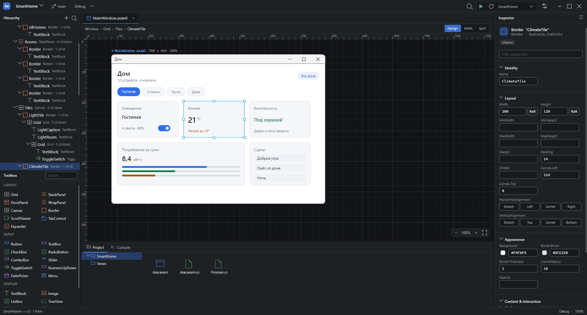

# ArxisStudio.Surface

Библиотеки для Avalonia 12 под редакторы с бесконечным холстом: дизайнер интерфейса, редактор узлов,
свой редактор поверх `SurfaceView`. Четыре сборки и четыре пакета; ссылки идут только вниз — ядро не
знает, что лежит на холсте, инструменты не знают редакторов, редакторы не знают друг друга.



## Пакеты

| Пакет | Содержимое | Зависит от | Документация |
| --- | --- | --- | --- |
| `ArxisStudio.Surface` | холст, viewport, сетка, контейнеры и виртуализация, выделение, жесты, клавиатура, контракт изменений, `SurfaceHistory`, упрощённый вид | Avalonia, Avalonia.Skia | [src/Surface](src/Surface/README.md) |
| `ArxisStudio.Surface.Editing` | ручки изменения размера, привязка, направляющие и интервалы, линейки, блокировки, миникарта | ядро | [src/Surface.Editing](src/Surface.Editing/README.md) |
| `ArxisStudio.Surface.UiDesigner` | `UiDesignerView`: вложенные контролы, стратегии размещения, перестановка, группы | ядро, инструменты | [src/Surface.UiDesigner](src/Surface.UiDesigner/README.md) |
| `ArxisStudio.Surface.Nodes` | `NodeEditor`: узлы, порты, связи, узлы перенаправления, разрез, роли пинов (данные, выполнение, делегат), импульсы и маркеры на проводах | ядро, инструменты | [src/Surface.Nodes](src/Surface.Nodes/README.md) |

TFM библиотек — `net8.0` (минимальный у Avalonia 12), Avalonia 12.1.1, версия `0.x`. В NuGet не
публикуется: подключается ссылкой на проект или локальным пакетом (`dotnet pack`).

## Подключение

Приложение подключает одну тему — ту, что соответствует контролу; она включает темы нижних слоёв.

| Контрол | Тема |
| --- | --- |
| `SurfaceView` | `avares://ArxisStudio.Surface/Themes/SurfaceTheme.axaml` |
| `UiDesignerView` | `avares://ArxisStudio.Surface.UiDesigner/Themes/UiDesignerTheme.axaml` |
| `NodeEditor` | `avares://ArxisStudio.Surface.Nodes/Themes/ArxisStudioNodeEditorTheme.axaml` |

Все сборки объявлены под одним адресом разметки:

```xml
xmlns:surface="https://github.com/Arxis-Team/ArxisStudio.Surface"
```

```xml
<surface:UiDesignerView ItemsSource="{Binding Screens}" SelectionMode="Multiple" />

<surface:NodeEditor ItemsSource="{Binding Nodes}" ItemLocationBinding="{Binding Location}"
                    ItemHeaderBinding="{Binding Title}"
                    Links="{Binding Links}"
                    LinkSourceBinding="{Binding From}" LinkTargetBinding="{Binding To}" />
```

## Контракт с хостом

- Геометрию и `ZIndex` поверхность пишет сама и сообщает одним `EditCompleted` на жест. Структуру —
  создание, удаление, перестановку, связи — она не правит, а запрашивает событиями с `Handled`
  (ADR 0001, 0004).
- Отмену ведёт хост. `SurfaceHistory` держит в одном стеке единицы редактирования поверхности и
  структурные правки хоста (`ISurfaceChange`).
- Коллекции и модели принадлежат хосту. С `ItemLocationBinding` положение элемента живёт в модели, и
  контейнер есть только у видимого с запасом (ADR 0007, 0010).
- Значения оформления — ключи темы с вариантами `Light` и `Dark` (`Surface.*`, `UiDesigner.*`,
  `NodeEditor.*`, `SurfaceMinimap.*`); шаблоны для этого не копируют.

## Публичная поверхность

91 публичный тип: 43 в ядре, 16 в инструментах, 12 в дизайнере интерфейса, 20 в редакторе узлов.
Слепок каждой сборки — до члена и значения по умолчанию у `AvaloniaProperty` — лежит в
`tests/ArxisStudio.Surface.Tests/PublicSurface.<сборка>.baseline.txt`; новый публичный член роняет
`PublicSurfaceTests`, пока слепок не обновлён. Машины состояний, стратегии размещения, резолверы
направляющих, швы ядра и службы инструментов — internal и открыты слоям выше через
`InternalsVisibleTo`.

## Репозиторий

```
src/Surface/                 ядро
src/Surface.Editing/         инструменты
src/Surface.UiDesigner/      дизайнер интерфейса
src/Surface.Nodes/           редактор узлов
tests/                       headless-тесты всех сборок (Avalonia.Headless.XUnit, xunit v3)
samples/UiDesigner.Demo/     хост дизайнера интерфейса: конструктор форм на Surface, Markup и ProjectSystem
  SmartHome/                 проект, который этот хост открывает; с его формы сняты снимки
samples/Nodes.Demo/          хост редактора узлов: граф данных, 10 000 узлов, волна вычисления
samples/Nodes.StateMachine/  машина состояний на узлах, ведёт интерфейс Avalonia
samples/Nodes.Calculator/    калькулятор в духе Blueprint: палитра действий, литералы, «Играть»
docs/adr/                    архитектурные решения
```

```bash
dotnet build ArxisStudio.Surface.sln
dotnet test tests/ArxisStudio.Surface.Tests
dotnet run --project samples/Nodes.Demo
dotnet pack ArxisStudio.Surface.sln -c Release -o artifacts
```

Сборка идёт с нулём предупреждений; у библиотек включён `GenerateDocumentationFile`, публичный член
без XML-комментария — ошибка сборки.

| Образец | Что показывает | Проверка вживую |
| --- | --- | --- |
| `UiDesigner.Demo` | конструктор форм: открывает проект, показывает `.axaml` элементом формы, правит документ жестами и инспектором, собирает и запускает; нужны соседние `ArxisStudio.ProjectSystem` и `ArxisStudio.Markup` | `--verify <папка>`, `--shot <файл>`, канал `--automation <каталог>`, F12 (DevTools) в Debug |
| `Nodes.Demo` | запросы графа, узлы перенаправления, разрез, миникарта, 10 000 узлов, роли пинов и пример наблюдателя на делегате, импульсы по волне вычисления, маркеры по типу провода | канал `--automation <каталог>`, `panBench`, F12 в Debug |
| `Nodes.StateMachine` | запуск машины с показом как в Unreal, контекстное меню, импульсы по сработавшему переходу | F12 в Debug, MCP DevTools |
| `Nodes.Calculator` | граф в духе Blueprint: компактные узлы математики, литералы пинов, палитра действий с поиском по правой кнопке и по проводу в пустоту, узел преобразования между типами, переменные, «Играть» с импульсами, строками на экране и журналом | F12 в Debug, MCP DevTools |

## Решения

| ADR | Решение |
| --- | --- |
| [0001](docs/adr/0001-the-editor-reads-the-tree-and-never-writes-it.md) | Редактор владеет геометрией; структуру он читает и выражает запросами |
| [0002](docs/adr/0002-where-the-group-mark-lives-belongs-to-the-document-owner.md) | Смысл группы — у редактора, место хранения пометки — у владельца документа |
| [0003](docs/adr/0003-the-library-is-three-layers-and-references-go-down.md) | Библиотека — слои, ссылки идут только вниз |
| [0004](docs/adr/0004-the-node-editor-is-a-fourth-layer-beside-the-form-designer.md) | Редактор узлов — четвёртый слой рядом с дизайнером интерфейса; связь знает концы данными портов |
| [0005](docs/adr/0005-a-bend-is-a-reroute-node-and-the-minimap-is-a-surface-tool.md) | Излом связи — узел перенаправления хоста; разрез — удаление перечёркнутых; миникарта — инструмент любой поверхности |
| [0006](docs/adr/0006-names-follow-the-layers.md) | Имена следуют слоям: `Surface*`, `<Слой>View`, ключи темы по слою |
| [0007](docs/adr/0007-containers-follow-the-viewport.md) | Контейнеры следуют видимой области; связи — записи; миникарта рисует закешированное |
| [0008](docs/adr/0008-the-small-zoom-is-drawn-not-realized.md) | Ниже `SimplifiedZoom` элементы — карточки без контейнеров; нажатие разворачивает |
| [0009](docs/adr/0009-the-node-card-has-a-header-and-the-host-designs-it.md) | Базовый вид узла — темой; заголовок, полоса и цвет провода — привязками к модели |
| [0010](docs/adr/0010-selection-is-data.md) | Выбор — данные: `SelectedItems` полный, свёрнутое двигается записью в модель |
| [0011](docs/adr/0011-panning-costs-what-is-visible.md) | Панорама стоит видимого: слои — своей операцией по сетке ячеек, окно — шагом, запас — порциями |
| [0012](docs/adr/0012-large-layers-draw-through-skia.md) | Большие слои рисуют Skia напрямую, без Skia — прежний путь |
| [0013](docs/adr/0013-the-reroute-node-faces-the-wire.md) | Узел перенаправления разворачивается по проводу; повисший снимает хост; упрощённый вид узлов — ниже 0,3 |
| [0014](docs/adr/0014-the-wire-shows-the-flow.md) | Импульсы `PulseLink` и маркеры `LinkMarker` на проводах, у каждых свой выключатель |
| [0015](docs/adr/0015-the-wire-bends-like-blueprint.md) | Касательная провода — по правилу и числам Blueprint, отдельно вперёд и назад; настройка — `LinkCurve` |
| [0016](docs/adr/0016-execution-pins-are-the-hosts-kind.md) | Пины и провода выполнения: вид — форма и цвет штырька, толщина провода; смысл и правила — хоста |
| [0017](docs/adr/0017-pin-roles-give-the-base-look.md) | Роли пинов — данные, выполнение, делегат: базовый вид из темы, хост сильнее роли, правил у роли нет |
| [0018](docs/adr/0018-a-wire-dropped-on-empty-canvas-is-the-hosts-cue.md) | Провод, отпущенный в пустоту, — `ConnectDropped` с портом и точкой; меню действий и новый узел — хоста |
| [0019](docs/adr/0019-a-link-starts-at-the-pin.md) | Связь начинается от штырька, в зоне захвата `PinGrabSize`; подпись порта тянет узел |
| [0020](docs/adr/0020-the-form-item-holds-the-document-root.md) | Корень документа держит элемент дизайнера `UiDesignerFormItem`; вид по корню — псевдоклассами |

## Лицензия

MIT, см. [LICENSE](LICENSE).
